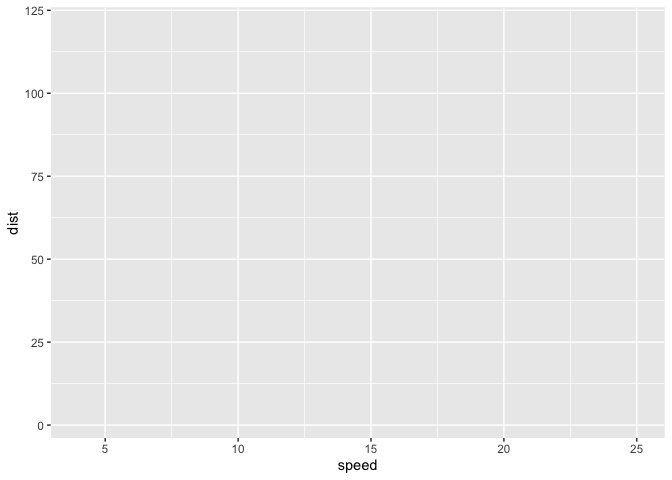
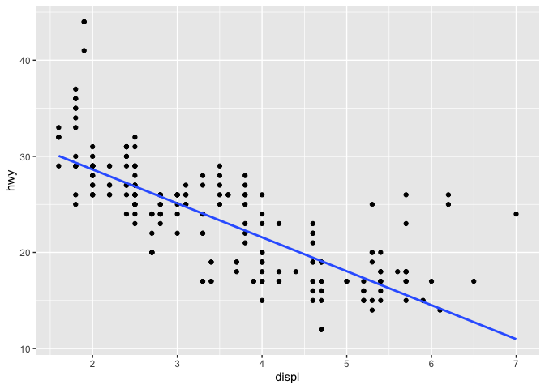
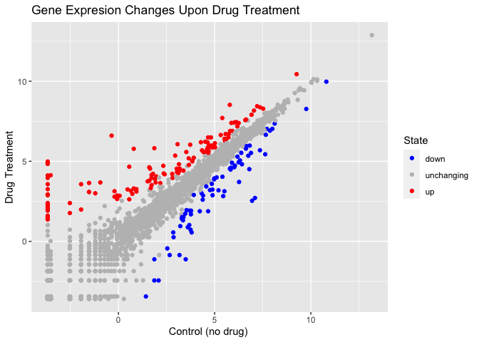

Class 05: Data Visualization with GGPLOT
================
Tahmid Ahmed

``` r
#install.packages("ggplot2")
library(ggplot2)
ggplot(cars) + aes(x=speed, y=dist)
```



``` r
ggplot(mpg) + aes(x=displ, y=hwy) +geom_point()
```


``` r
ggplot(mpg) + aes(x=displ, y=hwy) +geom_point() + geom_smooth(method= lm, se= FALSE)
```

    `geom_smooth()` using formula = 'y ~ x'



``` r
ggplot(cars) + aes(x=speed, y=dist) + geom_point() + geom_smooth(method=lm, se= FALSE)
```

    `geom_smooth()` using formula = 'y ~ x'


``` r
url <- "https://bioboot.github.io/bimm143_S20/class-material/up_down_expression.txt"
genes <- read.delim(url)
head(genes)
```

            Gene Condition1 Condition2      State
    1      A4GNT -3.6808610 -3.4401355 unchanging
    2       AAAS  4.5479580  4.3864126 unchanging
    3      AASDH  3.7190695  3.4787276 unchanging
    4       AATF  5.0784720  5.0151916 unchanging
    5       AATK  0.4711421  0.5598642 unchanging
    6 AB015752.4 -3.6808610 -3.5921390 unchanging

``` r
ggplot(genes) + aes(x=Condition1, y=Condition2) + geom_point()
```


``` r
ggplot(genes) + aes(x=Condition1, y=Condition2, col=State) + geom_point() 
```


``` r
 ggplot(genes) + aes(x=Condition1, y=Condition2, col=State) + geom_point() + scale_colour_manual( values=c("blue","gray","red") )
```


``` r
ggplot(genes) + aes(x=Condition1, y=Condition2, col=State) + geom_point() + scale_colour_manual(values=c("blue","gray","red")) +
    labs(title="Gene Expresion Changes Upon Drug Treatment",
         x="Control (no drug) ",
         y="Drug Treatment")
```


