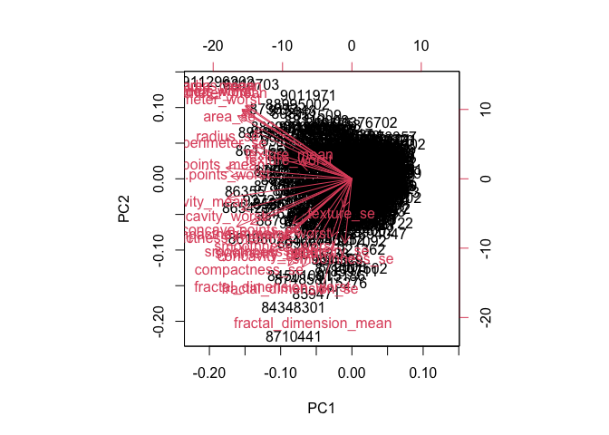
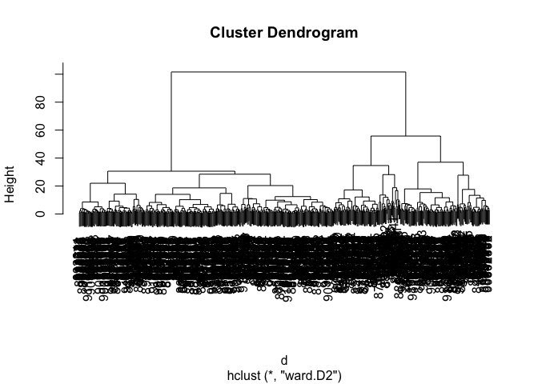

Class 8 Mini Project
================

Preparing the Data

``` r
# Save your input data file into your Project directory
fna.data <- "WisconsinCancer.csv"

# Complete the following code to input the data and store as wisc.df
wisc.df <- read.csv(fna.data, row.names=1)
```

Viewing head of dataset

``` r
head(wisc.df)
```

             diagnosis radius_mean texture_mean perimeter_mean area_mean
    842302           M       17.99        10.38         122.80    1001.0
    842517           M       20.57        17.77         132.90    1326.0
    84300903         M       19.69        21.25         130.00    1203.0
    84348301         M       11.42        20.38          77.58     386.1
    84358402         M       20.29        14.34         135.10    1297.0
    843786           M       12.45        15.70          82.57     477.1
             smoothness_mean compactness_mean concavity_mean concave.points_mean
    842302           0.11840          0.27760         0.3001             0.14710
    842517           0.08474          0.07864         0.0869             0.07017
    84300903         0.10960          0.15990         0.1974             0.12790
    84348301         0.14250          0.28390         0.2414             0.10520
    84358402         0.10030          0.13280         0.1980             0.10430
    843786           0.12780          0.17000         0.1578             0.08089
             symmetry_mean fractal_dimension_mean radius_se texture_se perimeter_se
    842302          0.2419                0.07871    1.0950     0.9053        8.589
    842517          0.1812                0.05667    0.5435     0.7339        3.398
    84300903        0.2069                0.05999    0.7456     0.7869        4.585
    84348301        0.2597                0.09744    0.4956     1.1560        3.445
    84358402        0.1809                0.05883    0.7572     0.7813        5.438
    843786          0.2087                0.07613    0.3345     0.8902        2.217
             area_se smoothness_se compactness_se concavity_se concave.points_se
    842302    153.40      0.006399        0.04904      0.05373           0.01587
    842517     74.08      0.005225        0.01308      0.01860           0.01340
    84300903   94.03      0.006150        0.04006      0.03832           0.02058
    84348301   27.23      0.009110        0.07458      0.05661           0.01867
    84358402   94.44      0.011490        0.02461      0.05688           0.01885
    843786     27.19      0.007510        0.03345      0.03672           0.01137
             symmetry_se fractal_dimension_se radius_worst texture_worst
    842302       0.03003             0.006193        25.38         17.33
    842517       0.01389             0.003532        24.99         23.41
    84300903     0.02250             0.004571        23.57         25.53
    84348301     0.05963             0.009208        14.91         26.50
    84358402     0.01756             0.005115        22.54         16.67
    843786       0.02165             0.005082        15.47         23.75
             perimeter_worst area_worst smoothness_worst compactness_worst
    842302            184.60     2019.0           0.1622            0.6656
    842517            158.80     1956.0           0.1238            0.1866
    84300903          152.50     1709.0           0.1444            0.4245
    84348301           98.87      567.7           0.2098            0.8663
    84358402          152.20     1575.0           0.1374            0.2050
    843786            103.40      741.6           0.1791            0.5249
             concavity_worst concave.points_worst symmetry_worst
    842302            0.7119               0.2654         0.4601
    842517            0.2416               0.1860         0.2750
    84300903          0.4504               0.2430         0.3613
    84348301          0.6869               0.2575         0.6638
    84358402          0.4000               0.1625         0.2364
    843786            0.5355               0.1741         0.3985
             fractal_dimension_worst
    842302                   0.11890
    842517                   0.08902
    84300903                 0.08758
    84348301                 0.17300
    84358402                 0.07678
    843786                   0.12440

Removing first column

``` r
# We can use -1 here to remove the first column
wisc.data <- wisc.df[,-1]
```

Creating Diagnosis Vector

``` r
diagnosis <- as.factor(wisc.df[,1])
diagnosis
```

      [1] M M M M M M M M M M M M M M M M M M M B B B M M M M M M M M M M M M M M M
     [38] B M M M M M M M M B M B B B B B M M B M M B B B B M B M M B B B B M B M M
     [75] B M B M M B B B M M B M M M B B B M B B M M B B B M M B B B B M B B M B B
    [112] B B B B B B M M M B M M B B B M M B M B M M B M M B B M B B M B B B B M B
    [149] B B B B B B B B M B B B B M M B M B B M M B B M M B B B B M B B M M M B M
    [186] B M B B B M B B M M B M M M M B M M M B M B M B B M B M M M M B B M M B B
    [223] B M B B B B B M M B B M B B M M B M B B B B M B B B B B M B M M M M M M M
    [260] M M M M M M M B B B B B B M B M B B M B B M B M M B B B B B B B B B B B B
    [297] B M B B M B M B B B B B B B B B B B B B B M B B B M B M B B B B M M M B B
    [334] B B M B M B M B B B M B B B B B B B M M M B B B B B B B B B B B M M B M M
    [371] M B M M B B B B B M B B B B B M B B B M B B M M B B B B B B M B B B B B B
    [408] B M B B B B B M B B M B B B B B B B B B B B B M B M M B M B B B B B M B B
    [445] M B M B B M B M B B B B B B B B M M B B B B B B M B B B B B B B B B B M B
    [482] B B B B B B M B M B B M B B B B B M M B M B M B B B B B M B B M B M B M M
    [519] B B B M B B B B B B B B B B B M B M M B B B B B B B B B B B B B B B B B B
    [556] B B B B B B B M M M M M M B
    Levels: B M

> Q1. How many observations are in this dataset?

``` r
dim(wisc.data)
```

    [1] 569  30

There are 569 rows therefore there are 569 observations

> Q2. How many of the observations have a malignant diagnosis?

Using `table()` to find total number of Ms there are a total of 212
malignant diagnoses.

``` r
table(diagnosis)
```

    diagnosis
      B   M 
    357 212 

> Q3. How many variables/features in the data are suffixed with \_mean?

``` r
length(grep("_mean", colnames(wisc.data)))
```

    [1] 10

There are 10 variables with the names with a suffix of \_mean.

Preforming PCA

``` r
# Check column means and standard deviations
colMeans(wisc.data)
```

                radius_mean            texture_mean          perimeter_mean 
               1.412729e+01            1.928965e+01            9.196903e+01 
                  area_mean         smoothness_mean        compactness_mean 
               6.548891e+02            9.636028e-02            1.043410e-01 
             concavity_mean     concave.points_mean           symmetry_mean 
               8.879932e-02            4.891915e-02            1.811619e-01 
     fractal_dimension_mean               radius_se              texture_se 
               6.279761e-02            4.051721e-01            1.216853e+00 
               perimeter_se                 area_se           smoothness_se 
               2.866059e+00            4.033708e+01            7.040979e-03 
             compactness_se            concavity_se       concave.points_se 
               2.547814e-02            3.189372e-02            1.179614e-02 
                symmetry_se    fractal_dimension_se            radius_worst 
               2.054230e-02            3.794904e-03            1.626919e+01 
              texture_worst         perimeter_worst              area_worst 
               2.567722e+01            1.072612e+02            8.805831e+02 
           smoothness_worst       compactness_worst         concavity_worst 
               1.323686e-01            2.542650e-01            2.721885e-01 
       concave.points_worst          symmetry_worst fractal_dimension_worst 
               1.146062e-01            2.900756e-01            8.394582e-02 

``` r
apply(wisc.data,2,sd)
```

                radius_mean            texture_mean          perimeter_mean 
               3.524049e+00            4.301036e+00            2.429898e+01 
                  area_mean         smoothness_mean        compactness_mean 
               3.519141e+02            1.406413e-02            5.281276e-02 
             concavity_mean     concave.points_mean           symmetry_mean 
               7.971981e-02            3.880284e-02            2.741428e-02 
     fractal_dimension_mean               radius_se              texture_se 
               7.060363e-03            2.773127e-01            5.516484e-01 
               perimeter_se                 area_se           smoothness_se 
               2.021855e+00            4.549101e+01            3.002518e-03 
             compactness_se            concavity_se       concave.points_se 
               1.790818e-02            3.018606e-02            6.170285e-03 
                symmetry_se    fractal_dimension_se            radius_worst 
               8.266372e-03            2.646071e-03            4.833242e+00 
              texture_worst         perimeter_worst              area_worst 
               6.146258e+00            3.360254e+01            5.693570e+02 
           smoothness_worst       compactness_worst         concavity_worst 
               2.283243e-02            1.573365e-01            2.086243e-01 
       concave.points_worst          symmetry_worst fractal_dimension_worst 
               6.573234e-02            6.186747e-02            1.806127e-02 

``` r
# Perform PCA on wisc.data by completing the following code
wisc.pr <- prcomp(wisc.data, scale = TRUE)
summary(wisc.pr)
```

    Importance of components:
                              PC1    PC2     PC3     PC4     PC5     PC6     PC7
    Standard deviation     3.6444 2.3857 1.67867 1.40735 1.28403 1.09880 0.82172
    Proportion of Variance 0.4427 0.1897 0.09393 0.06602 0.05496 0.04025 0.02251
    Cumulative Proportion  0.4427 0.6324 0.72636 0.79239 0.84734 0.88759 0.91010
                               PC8    PC9    PC10   PC11    PC12    PC13    PC14
    Standard deviation     0.69037 0.6457 0.59219 0.5421 0.51104 0.49128 0.39624
    Proportion of Variance 0.01589 0.0139 0.01169 0.0098 0.00871 0.00805 0.00523
    Cumulative Proportion  0.92598 0.9399 0.95157 0.9614 0.97007 0.97812 0.98335
                              PC15    PC16    PC17    PC18    PC19    PC20   PC21
    Standard deviation     0.30681 0.28260 0.24372 0.22939 0.22244 0.17652 0.1731
    Proportion of Variance 0.00314 0.00266 0.00198 0.00175 0.00165 0.00104 0.0010
    Cumulative Proportion  0.98649 0.98915 0.99113 0.99288 0.99453 0.99557 0.9966
                              PC22    PC23   PC24    PC25    PC26    PC27    PC28
    Standard deviation     0.16565 0.15602 0.1344 0.12442 0.09043 0.08307 0.03987
    Proportion of Variance 0.00091 0.00081 0.0006 0.00052 0.00027 0.00023 0.00005
    Cumulative Proportion  0.99749 0.99830 0.9989 0.99942 0.99969 0.99992 0.99997
                              PC29    PC30
    Standard deviation     0.02736 0.01153
    Proportion of Variance 0.00002 0.00000
    Cumulative Proportion  1.00000 1.00000

> Q4. From your results, what proportion of the original variance is
> captured by the first principal components (PC1)?

A proportion of 0.4427 (44.27%) of the original variance is captured by
PC 1.

> How many principal components (PCs) are required to describe at least
> 70% of the original variance in the data?

It takes 3 PCs to cover at least 70% of the original variance.

> How many principal components (PCs) are required to describe at least
> 90% of the original variance in the data?

It takes 7 PCs to cover at least 90% of the original variance.

Interpreting PCA Results

``` r
biplot(wisc.pr)
```



> Q7. What stands out to you about this plot? Is it easy or difficult to
> understand? Why?

The plot looks very cramped and is very difficult to gain meaning out
of. Everything is clumped together and impossible to read.

Scatterplot

``` r
# Scatter plot observations by components 1 and 2
plot( wisc.pr$x , col = diagnosis , 
     xlab = "PC1", ylab = "PC2")
```


> Q8. Generate a similar plot for principal components 1 and 3. What do
> you notice about these plots?

I notice there is a good amount of overlap with outliers present as
well. I’d say to treat the outliers first since they are far from the
“norm” in this case. In addition, the graph of PC 1 and 3 has the points
lower on the graph than PC 1 and 2 which is indicative of PC3 covering
less variance than PC2.

``` r
# Repeat for components 1 and 3
plot(wisc.pr$x[, c(1,3)], col = diagnosis, 
     xlab = "PC1", ylab = "PC3")
```


``` r
# Create a data.frame for ggplot
df <- as.data.frame(wisc.pr$x)
df$diagnosis <- diagnosis

# Load the ggplot2 package
library(ggplot2)

# Make a scatter plot colored by diagnosis
ggplot(df) + 
  aes(PC1, PC2, col=diagnosis) + 
  geom_point()
```


Variance Explained

``` r
# Calculate variance of each component
pr.var <- wisc.pr$sdev^2
head(pr.var)
```

    [1] 13.281608  5.691355  2.817949  1.980640  1.648731  1.207357

``` r
# Variance explained by each principal component: pve
pve <- pr.var / sum(pr.var)

# Plot variance explained for each principal component
plot(pve, xlab = "Principal Component", 
     ylab = "Proportion of Variance Explained", 
     ylim = c(0, 1), type = "o")
```


``` r
# Alternative scree plot of the same data, note data driven y-axis
barplot(pve, ylab = "Precent of Variance Explained",
     names.arg=paste0("PC",1:length(pve)), las=2, axes = FALSE)
axis(2, at=pve, labels=round(pve,2)*100 )
```


``` r
## ggplot based graph
#install.packages("factoextra")
library(factoextra)
```

    Welcome! Want to learn more? See two factoextra-related books at https://goo.gl/ve3WBa

``` r
fviz_eig(wisc.pr, addlabels = TRUE)
```


``` r
y <- summary(wisc.pr)
attributes(y)
```

    $names
    [1] "sdev"       "rotation"   "center"     "scale"      "x"         
    [6] "importance"

    $class
    [1] "summary.prcomp"

> Q9. For the first principal component, what is the component of the
> loading vector (i.e. wisc.pr\$rotation\[,1\]) for the feature
> concave.points_mean?

``` r
wisc.pr$rotation[,1]
```

                radius_mean            texture_mean          perimeter_mean 
                -0.21890244             -0.10372458             -0.22753729 
                  area_mean         smoothness_mean        compactness_mean 
                -0.22099499             -0.14258969             -0.23928535 
             concavity_mean     concave.points_mean           symmetry_mean 
                -0.25840048             -0.26085376             -0.13816696 
     fractal_dimension_mean               radius_se              texture_se 
                -0.06436335             -0.20597878             -0.01742803 
               perimeter_se                 area_se           smoothness_se 
                -0.21132592             -0.20286964             -0.01453145 
             compactness_se            concavity_se       concave.points_se 
                -0.17039345             -0.15358979             -0.18341740 
                symmetry_se    fractal_dimension_se            radius_worst 
                -0.04249842             -0.10256832             -0.22799663 
              texture_worst         perimeter_worst              area_worst 
                -0.10446933             -0.23663968             -0.22487053 
           smoothness_worst       compactness_worst         concavity_worst 
                -0.12795256             -0.21009588             -0.22876753 
       concave.points_worst          symmetry_worst fractal_dimension_worst 
                -0.25088597             -0.12290456             -0.13178394 

``` r
wisc.pr$rotation["concave.points_mean",1]
```

    [1] -0.2608538

> Q10. What is the minimum number of principal components required to
> explain 80% of the variance of the data?

``` r
sum(y$importance[3,] <=0.8)
```

    [1] 4

``` r
y
```

    Importance of components:
                              PC1    PC2     PC3     PC4     PC5     PC6     PC7
    Standard deviation     3.6444 2.3857 1.67867 1.40735 1.28403 1.09880 0.82172
    Proportion of Variance 0.4427 0.1897 0.09393 0.06602 0.05496 0.04025 0.02251
    Cumulative Proportion  0.4427 0.6324 0.72636 0.79239 0.84734 0.88759 0.91010
                               PC8    PC9    PC10   PC11    PC12    PC13    PC14
    Standard deviation     0.69037 0.6457 0.59219 0.5421 0.51104 0.49128 0.39624
    Proportion of Variance 0.01589 0.0139 0.01169 0.0098 0.00871 0.00805 0.00523
    Cumulative Proportion  0.92598 0.9399 0.95157 0.9614 0.97007 0.97812 0.98335
                              PC15    PC16    PC17    PC18    PC19    PC20   PC21
    Standard deviation     0.30681 0.28260 0.24372 0.22939 0.22244 0.17652 0.1731
    Proportion of Variance 0.00314 0.00266 0.00198 0.00175 0.00165 0.00104 0.0010
    Cumulative Proportion  0.98649 0.98915 0.99113 0.99288 0.99453 0.99557 0.9966
                              PC22    PC23   PC24    PC25    PC26    PC27    PC28
    Standard deviation     0.16565 0.15602 0.1344 0.12442 0.09043 0.08307 0.03987
    Proportion of Variance 0.00091 0.00081 0.0006 0.00052 0.00027 0.00023 0.00005
    Cumulative Proportion  0.99749 0.99830 0.9989 0.99942 0.99969 0.99992 0.99997
                              PC29    PC30
    Standard deviation     0.02736 0.01153
    Proportion of Variance 0.00002 0.00000
    Cumulative Proportion  1.00000 1.00000

The minimum number is 5 to cover at least 80% of variance of the data.

Combine PCA with clustering I want to cluster in “PC space”.

``` r
plot(wisc.pr$x[,1], wisc.pr$x[,2], col = diagnosis)
```


``` r
#summary(wisc.pr$x)
```

The `hclust()` function wants a distance matrix as input…

``` r
d <- dist(wisc.pr$x[,1:7])
wisc.pr.hclust <- hclust(d, method = "ward.D2")
plot(wisc.pr.hclust)
```



``` r
grps <- cutree(wisc.pr.hclust, k=2)
table(grps)
```

    grps
      1   2 
    216 353 

``` r
table(grps, diagnosis)
```

        diagnosis
    grps   B   M
       1  28 188
       2 329  24

``` r
plot(wisc.pr$x[,1:2], col=grps)
```


``` r
plot(wisc.pr$x[,1:2], col=diagnosis)
```


``` r
# Scale the wisc.data data using the "scale()" function
data.scaled <- scale(wisc.data)
```

``` r
data.dist <- dist(data.scaled)
```

``` r
wisc.hclust <- hclust(data.dist, method = "complete")
```

> Q11. Using the plot() and abline() functions, what is the height at
> which the clustering model has 4 clusters?

``` r
plot(wisc.hclust)
abline(h=19, col="red", lty=2)
```


At a height of 19 we get 4 clusters.

``` r
wisc.hclust.clusters <- cutree(wisc.hclust, k=6)
table(wisc.hclust.clusters, diagnosis)
```

                        diagnosis
    wisc.hclust.clusters   B   M
                       1  12 165
                       2   0   5
                       3 331  39
                       4   2   0
                       5  12   1
                       6   0   2

> Q12. Can you find a better cluster vs diagnoses match by cutting into
> a different number of clusters between 2 and 10?

I found 6 clusters to be best in this case.

> Q13. Which method gives your favorite results for the same data.dist
> dataset? Explain your reasoning.

``` r
wisc.hclust_method <- hclust(data.dist, method = "ward.D2")
plot(wisc.hclust_method)
```


I like the ward.D2 method. It creates clusters to minimize variance
within the clusters.

> Q15. How well does the newly created model with four clusters separate
> out the two diagnoses?

``` r
grps_4 <- cutree(wisc.pr.hclust, k=4)
table(grps_4)
```

    grps_4
      1   2   3   4 
     45  79  92 353 

``` r
table(grps_4, diagnosis)
```

          diagnosis
    grps_4   B   M
         1   0  45
         2   2  77
         3  26  66
         4 329  24

``` r
table(grps, diagnosis)
```

        diagnosis
    grps   B   M
       1  28 188
       2 329  24

The 4 clusters is worse since if something were to fall into cluster 3
the false positive rate is much higher than cluster 1 of the 2 cluster
method.

> Q17. Which of your analysis procedures resulted in a clustering model
> with the best specificity? How about sensitivity?

The combining methods was most useful to get the best specificity since
we were able to use the power of PCA and hclustering to find optimal
specificity. It also produces the best sensitivity as well.

> Q18. Which of these new patients should we prioritize for follow up
> based on your results?

We should follow up with the extreme outlier patients as they have the
highest variance from the norm.
