Class 7 Machine Learning 1
================
Tahmid Ahmed

# K-means clustering

First we will test how this method work in R with some made up data.

``` r
x <- rnorm(10000)
hist(x)
```

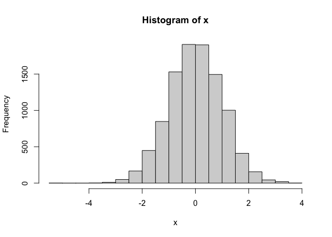

Let’s make some numbers centered on -3

``` r
tmp <- c(rnorm(30, -3), rnorm(30, 3))

x <- cbind(x = tmp, y = rev(tmp))
plot(x)
```

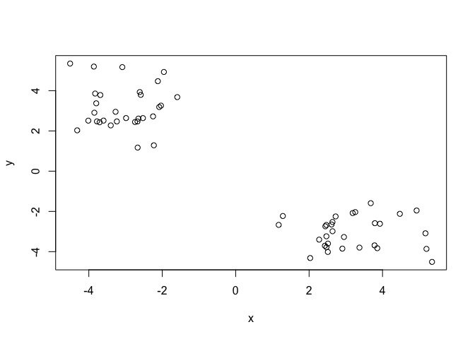

Now let’s see how `kmeans()` works with this data…

``` r
km <- kmeans(x, centers = 2, nstart = 20)
km
```

    K-means clustering with 2 clusters of sizes 30, 30

    Cluster means:
              x         y
    1  3.150289 -3.055375
    2 -3.055375  3.150289

    Clustering vector:
     [1] 2 2 2 2 2 2 2 2 2 2 2 2 2 2 2 2 2 2 2 2 2 2 2 2 2 2 2 2 2 2 1 1 1 1 1 1 1 1
    [39] 1 1 1 1 1 1 1 1 1 1 1 1 1 1 1 1 1 1 1 1 1 1

    Within cluster sum of squares by cluster:
    [1] 51.71147 51.71147
     (between_SS / total_SS =  91.8 %)

    Available components:

    [1] "cluster"      "centers"      "totss"        "withinss"     "tot.withinss"
    [6] "betweenss"    "size"         "iter"         "ifault"      

``` r
km$centers
```

              x         y
    1  3.150289 -3.055375
    2 -3.055375  3.150289

> Q. How many points are in each cluster?

``` r
km$size
```

    [1] 30 30

> Q. What ‘component’ of your result object details - cluster
> assignment/membership? -cluster center?

``` r
km$cluster
```

     [1] 2 2 2 2 2 2 2 2 2 2 2 2 2 2 2 2 2 2 2 2 2 2 2 2 2 2 2 2 2 2 1 1 1 1 1 1 1 1
    [39] 1 1 1 1 1 1 1 1 1 1 1 1 1 1 1 1 1 1 1 1 1 1

``` r
km$centers
```

              x         y
    1  3.150289 -3.055375
    2 -3.055375  3.150289

> Q. Plot x colored by the kmeans cluster assignment and add cluster
> centers as blue points

``` r
plot(x, col= km$cluster)
points(km$centers, col = "blue", pch = 15, cex = 2)
```

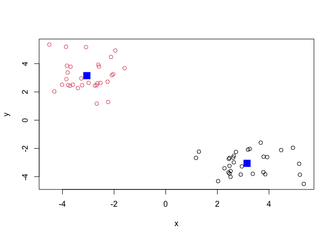

# Hierarchical Clustering

The `hclus()` function in R performs hierarchical clustering.

The `hclus()` function requires an input distance matrix, which I can
get from the `dist()` function.

``` r
hc <- hclust( dist(x) )
```

There is a `plot()` function to plot our hclust objects.

``` r
plot(hc)
```

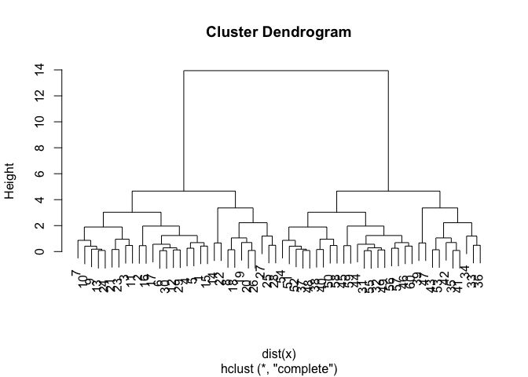

Now to get my cluster membership vector I need to “cut” the tree to
yield separate “branches” with the “leaves” on each branch being out
cluster. To do this we use the `cutree()` function.

``` r
cutree(hc, h = 8)
```

     [1] 1 1 1 1 1 1 1 1 1 1 1 1 1 1 1 1 1 1 1 1 1 1 1 1 1 1 1 1 1 1 2 2 2 2 2 2 2 2
    [39] 2 2 2 2 2 2 2 2 2 2 2 2 2 2 2 2 2 2 2 2 2 2

Use `cutree()` with a k=2.

``` r
grps <- cutree(hc, k=2)
```

A plot of our data colored by our hclust grps

``` r
plot(x, col = grps)
```

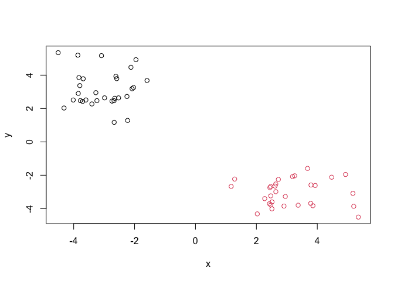

# Principal Component Analysis (PCA)

``` r
url <- "https://tinyurl.com/UK-foods"
x <- read.csv(url)
```

> Q1. How many rows and columns are in your new data frame named x? What
> R functions could you use to answer this questions?

``` r
dim(x)
```

    [1] 17  5

This tells me that I have 17 rows and 5 columns.

\##Preview first few rows

``` r
head(x)
```

                   X England Wales Scotland N.Ireland
    1         Cheese     105   103      103        66
    2  Carcass_meat      245   227      242       267
    3    Other_meat      685   803      750       586
    4           Fish     147   160      122        93
    5 Fats_and_oils      193   235      184       209
    6         Sugars     156   175      147       139

Fixing the row names

``` r
rownames(x) <- x[,1]
x <- x[,-1]
head(x)
```

                   England Wales Scotland N.Ireland
    Cheese             105   103      103        66
    Carcass_meat       245   227      242       267
    Other_meat         685   803      750       586
    Fish               147   160      122        93
    Fats_and_oils      193   235      184       209
    Sugars             156   175      147       139

Double-checking we have same rows and columns

``` r
dim(x)
```

    [1] 17  4

``` r
y <- read.csv(url, row.names=1)
head(y)
```

                   England Wales Scotland N.Ireland
    Cheese             105   103      103        66
    Carcass_meat       245   227      242       267
    Other_meat         685   803      750       586
    Fish               147   160      122        93
    Fats_and_oils      193   235      184       209
    Sugars             156   175      147       139

> Q2. Which approach to solving the ‘row-names problem’ mentioned above
> do you prefer and why? Is one approach more robust than another under
> certain circumstances?

I prefer the second approach since it reduces the lines of code needed.
The first is likely more robust since we can see what we are doing and
change the steps individually. The only issue with the first method is
if we run the code multiple times, it will keep removing the column in
the first position.

## Spotting major differences and trends

``` r
barplot(as.matrix(x), beside=T, col=rainbow(nrow(x)))
```


> Q3: Changing what optional argument in the above barplot() function
> results in the following plot?

``` r
barplot(as.matrix(x), beside=F, col=rainbow(nrow(x)))
```


Setting beside equal to FALSE produces the plot. Under the help section
for barplot, beside being false shows the columns of height as portrayed
as stacked bars whereas true shows the bars drawn horizontally with the
first at the bottom.

> Q5: Generating all pairwise plots may help somewhat. Can you make
> sense of the following code and resulting figure? What does it mean if
> a given point lies on the diagonal for a given plot?

``` r
pairs(x, col=rainbow(10), pch=16)
```


The `pairs()` function produces a matrix of scatterplots. A point being
on the diagonal shows a very high correlation likely close to 1. It
shows a very good fit for the data.

> Q6. What is the main differences between N. Ireland and the other
> countries of the UK in terms of this data-set?

N. Ireland has some large outliers for every country whereas the other
countries have pretty solid correlations.

## PCA to the rescue

``` r
# Use the prcomp() PCA function 
pca <- prcomp( t(x) )
summary(pca)
```

    Importance of components:
                                PC1      PC2      PC3       PC4
    Standard deviation     324.1502 212.7478 73.87622 4.189e-14
    Proportion of Variance   0.6744   0.2905  0.03503 0.000e+00
    Cumulative Proportion    0.6744   0.9650  1.00000 1.000e+00

> Q7. Complete the code below to generate a plot of PC1 vs PC2. The
> second line adds text labels over the data points.

``` r
# Plot PC1 vs PC2
plot(pca$x[,1], pca$x[,2], xlab="PC1", ylab="PC2", xlim=c(-270,500))
text(pca$x[,1], pca$x[,2], colnames(x))
```


> Q8. Customize your plot so that the colors of the country names match
> the colors in our UK and Ireland map and table at start of this
> document.

``` r
plot(pca$x[,1], pca$x[,2], xlab="PC1", ylab="PC2", xlim=c(-270,500))
text(pca$x[,1], pca$x[,2], colnames(x), col = c("orange", "red", "blue", "darkgreen"))
```

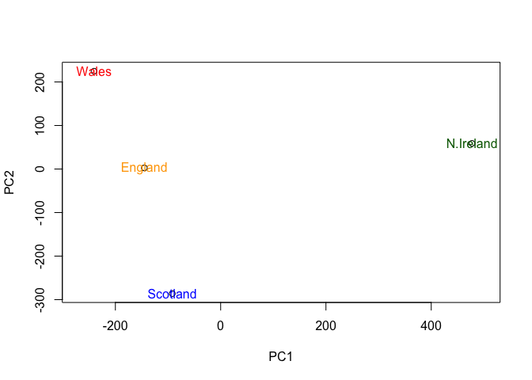

``` r
v <- round( pca$sdev^2/sum(pca$sdev^2) * 100 )
v
```

    [1] 67 29  4  0

``` r
## or the second row here...
z <- summary(pca)
z$importance
```

                                 PC1       PC2      PC3          PC4
    Standard deviation     324.15019 212.74780 73.87622 4.188568e-14
    Proportion of Variance   0.67444   0.29052  0.03503 0.000000e+00
    Cumulative Proportion    0.67444   0.96497  1.00000 1.000000e+00

``` r
barplot(v, xlab="Principal Component", ylab="Percent Variation")
```


``` r
## Lets focus on PC1 as it accounts for > 90% of variance 
par(mar=c(10, 3, 0.35, 0))
barplot( pca$rotation[,1], las=2 )
```


> Q9: Generate a similar ‘loadings plot’ for PC2. What two food groups
> feature prominantely and what does PC2 maninly tell us about?

``` r
par(mar=c(10, 3, 0.35, 0))
barplot( pca$rotation[,2], las=2 )
```

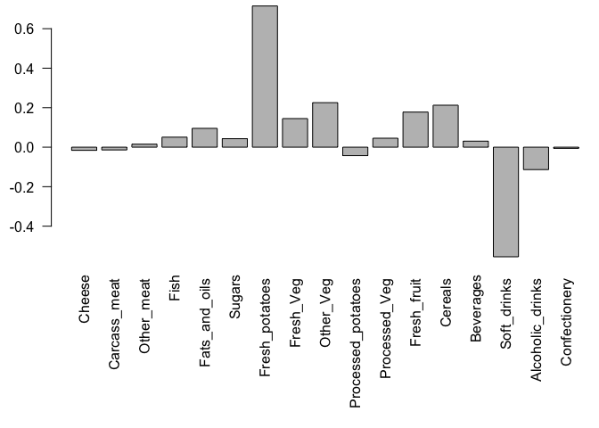

Soft_drinks and Fresh_potatoes are featured most prominently. PC2 shows
us how far away the data lies from PC1. PC2 is perpendicular to PC1
solely to capture the range of differences from PC1.

## PCA of RNA-Seq Data

``` r
url2 <- "https://tinyurl.com/expression-CSV"
rna.data <- read.csv(url2, row.names=1)
head(rna.data)
```

           wt1 wt2  wt3  wt4 wt5 ko1 ko2 ko3 ko4 ko5
    gene1  439 458  408  429 420  90  88  86  90  93
    gene2  219 200  204  210 187 427 423 434 433 426
    gene3 1006 989 1030 1017 973 252 237 238 226 210
    gene4  783 792  829  856 760 849 856 835 885 894
    gene5  181 249  204  244 225 277 305 272 270 279
    gene6  460 502  491  491 493 612 594 577 618 638

> Q10: How many genes and samples are in this data set?

``` r
dim(rna.data)
```

    [1] 100  10

There are 100 genes and 10 samples.

``` r
## Again we have to take the transpose of our data 
pca <- prcomp(t(rna.data), scale=TRUE)
 
## Simple un polished plot of pc1 and pc2
plot(pca$x[,1], pca$x[,2], xlab="PC1", ylab="PC2")
```

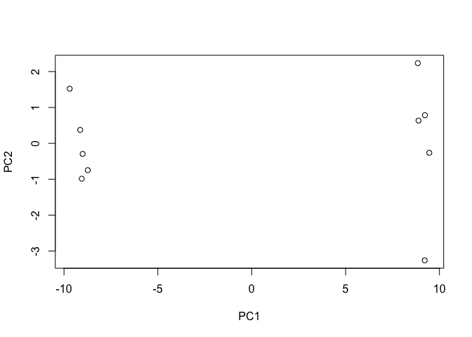

``` r
summary(pca)
```

    Importance of components:
                              PC1    PC2     PC3     PC4     PC5     PC6     PC7
    Standard deviation     9.6237 1.5198 1.05787 1.05203 0.88062 0.82545 0.80111
    Proportion of Variance 0.9262 0.0231 0.01119 0.01107 0.00775 0.00681 0.00642
    Cumulative Proportion  0.9262 0.9493 0.96045 0.97152 0.97928 0.98609 0.99251
                               PC8     PC9      PC10
    Standard deviation     0.62065 0.60342 3.348e-15
    Proportion of Variance 0.00385 0.00364 0.000e+00
    Cumulative Proportion  0.99636 1.00000 1.000e+00

``` r
plot(pca, main="Quick scree plot")
```

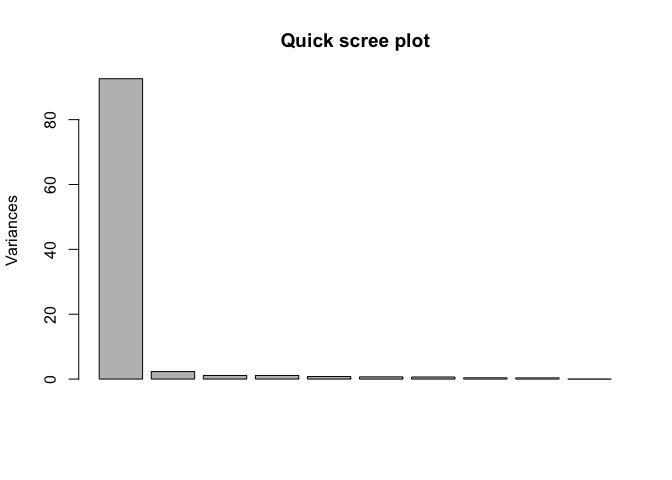

``` r
## Variance captured per PC 
pca.var <- pca$sdev^2

## Percent variance is often more informative to look at 
pca.var.per <- round(pca.var/sum(pca.var)*100, 1)
pca.var.per
```

     [1] 92.6  2.3  1.1  1.1  0.8  0.7  0.6  0.4  0.4  0.0

``` r
barplot(pca.var.per, main="Scree Plot", 
        names.arg = paste0("PC", 1:10),
        xlab="Principal Component", ylab="Percent Variation")
```

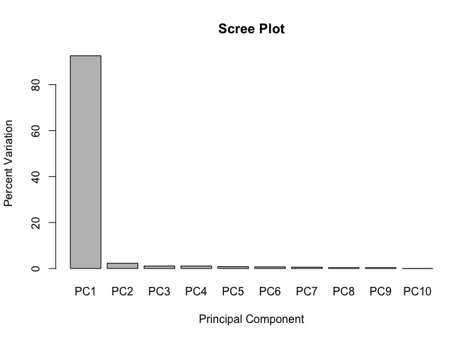

``` r
## A vector of colors for wt and ko samples
colvec <- colnames(rna.data)
colvec[grep("wt", colvec)] <- "red"
colvec[grep("ko", colvec)] <- "blue"

plot(pca$x[,1], pca$x[,2], col=colvec, pch=16,
     xlab=paste0("PC1 (", pca.var.per[1], "%)"),
     ylab=paste0("PC2 (", pca.var.per[2], "%)"))

text(pca$x[,1], pca$x[,2], labels = colnames(rna.data), pos=c(rep(4,5), rep(2,5)))
```

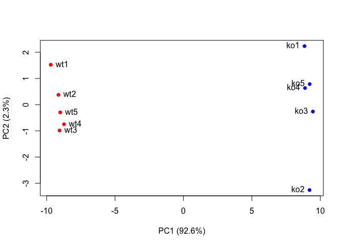
