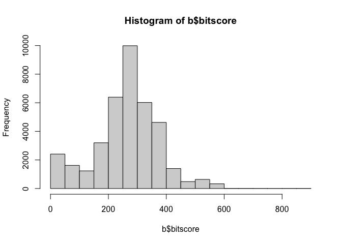
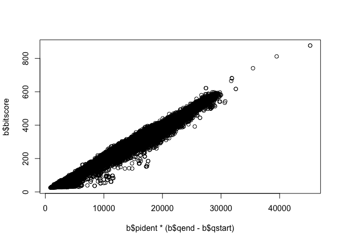
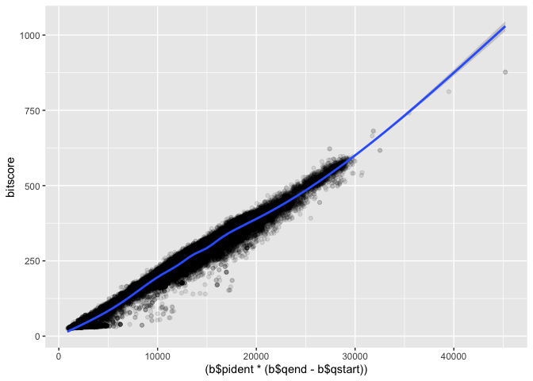

Class 15
================
Tahmid Ahmed

\#bioinf_tahmidahmed \#AWS: i-0e2b564f44d50b91a \#ubuntu@ip-172-31-12-38
\#ssh -i “bioinf_tahmidahmed.pem”
ubuntu@ec2-52-32-48-134.us-west-2.compute.amazonaws.com

Using RStudio online (or locally) to read your output

``` r
b <- read.table(file = "mm-second.x.zebrafish.tsv", col.names = c("qseqid", "sseqid", "pident", "length", "mismatch", "gapopen", "qstart", "qend", "sstart", "send", "evalue", "bitscore"))
```

``` r
hist(b$bitscore, 30)
```



``` r
plot(b$pident  * (b$qend - b$qstart), b$bitscore)
```



``` r
library(ggplot2)
ggplot(b, aes((b$pident * (b$qend - b$qstart)), bitscore)) + geom_point(alpha=0.1) + geom_smooth()
```

    Warning: Use of `b$pident` is discouraged.
    ℹ Use `pident` instead.

    Warning: Use of `b$qend` is discouraged.
    ℹ Use `qend` instead.

    Warning: Use of `b$qstart` is discouraged.
    ℹ Use `qstart` instead.

    Warning: Use of `b$pident` is discouraged.
    ℹ Use `pident` instead.

    Warning: Use of `b$qend` is discouraged.
    ℹ Use `qend` instead.

    Warning: Use of `b$qstart` is discouraged.
    ℹ Use `qstart` instead.

    `geom_smooth()` using method = 'gam' and formula = 'y ~ s(x, bs = "cs")'


