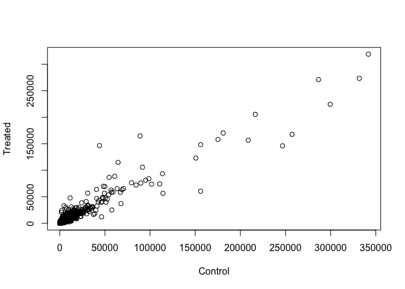
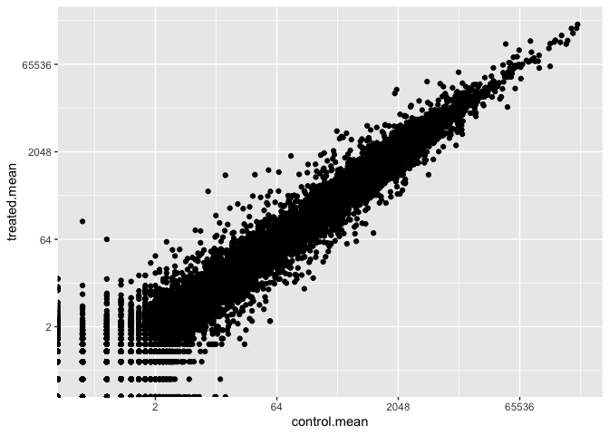
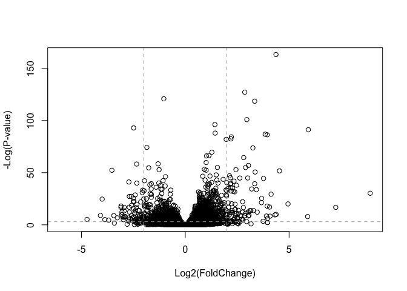
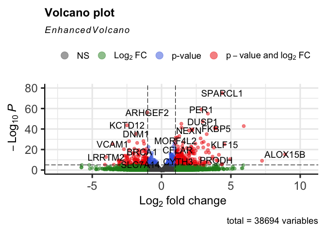
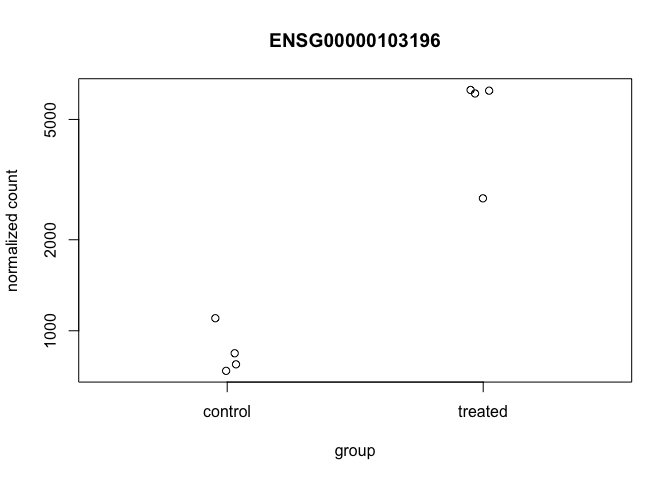
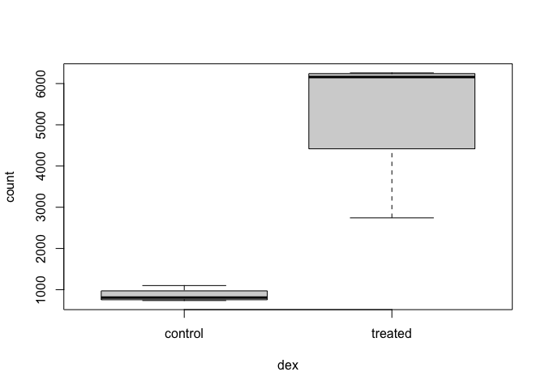
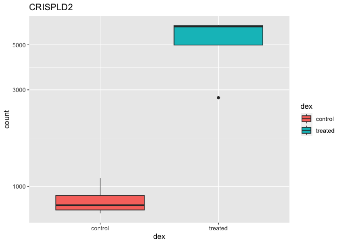

Lab 12: Transcriptomics and the analysis of RNA-Seq data
================
Tahmid Ahmed

Import Data

``` r
counts <- read.csv("airway_scaledcounts.csv", row.names=1)
metadata <-  read.csv("airway_metadata.csv")
```

``` r
head(counts)
```

                    SRR1039508 SRR1039509 SRR1039512 SRR1039513 SRR1039516
    ENSG00000000003        723        486        904        445       1170
    ENSG00000000005          0          0          0          0          0
    ENSG00000000419        467        523        616        371        582
    ENSG00000000457        347        258        364        237        318
    ENSG00000000460         96         81         73         66        118
    ENSG00000000938          0          0          1          0          2
                    SRR1039517 SRR1039520 SRR1039521
    ENSG00000000003       1097        806        604
    ENSG00000000005          0          0          0
    ENSG00000000419        781        417        509
    ENSG00000000457        447        330        324
    ENSG00000000460         94        102         74
    ENSG00000000938          0          0          0

``` r
head(metadata)
```

              id     dex celltype     geo_id
    1 SRR1039508 control   N61311 GSM1275862
    2 SRR1039509 treated   N61311 GSM1275863
    3 SRR1039512 control  N052611 GSM1275866
    4 SRR1039513 treated  N052611 GSM1275867
    5 SRR1039516 control  N080611 GSM1275870
    6 SRR1039517 treated  N080611 GSM1275871

``` r
#View(metadata)
#View(counts)
nrow(counts)
```

    [1] 38694

``` r
sum(metadata$dex =="control")
```

    [1] 4

> Q1 How many genes are in this dataset?

There are 38,694 genes.

> Q2 How many ‘control’ cell lines do we have?

There are 4 control cell lines.

``` r
control <- metadata[metadata[,"dex"]=="control",]
control.counts <- counts[ ,control$id]
control.mean <- rowSums( control.counts )/4 
head(control.mean)
```

    ENSG00000000003 ENSG00000000005 ENSG00000000419 ENSG00000000457 ENSG00000000460 
             900.75            0.00          520.50          339.75           97.25 
    ENSG00000000938 
               0.75 

``` r
library(dplyr)
```


    Attaching package: 'dplyr'

    The following objects are masked from 'package:stats':

        filter, lag

    The following objects are masked from 'package:base':

        intersect, setdiff, setequal, union

``` r
control <- metadata %>% filter(dex=="control")
control.counts <- counts %>% select(control$id) 
control.mean <- rowSums(control.counts)/4
head(control.mean)
```

    ENSG00000000003 ENSG00000000005 ENSG00000000419 ENSG00000000457 ENSG00000000460 
             900.75            0.00          520.50          339.75           97.25 
    ENSG00000000938 
               0.75 

> Q3. How would you make the above code in either approach more robust?

We will run into problems if we have a set that isn’t 4. It would be
better to find the mean count value for each transcript/gene by bind the
`rowMeans()`.

``` r
control.mean <- rowMeans(control.counts)
head(control.mean)
```

    ENSG00000000003 ENSG00000000005 ENSG00000000419 ENSG00000000457 ENSG00000000460 
             900.75            0.00          520.50          339.75           97.25 
    ENSG00000000938 
               0.75 

``` r
treated.id <- metadata[metadata$dex == "treated" , "id"]
treated.mean <- rowMeans(counts[,treated.id])
```

``` r
#treated.mean <- rowMeans(treated.counts)
#head(treated.mean)
```

> Q4. Follow the same procedure for the treated samples (i.e. calculate
> the mean per gene across drug treated samples and assign to a labeled
> vector called treated.mean)

``` r
library(dplyr)
treated <- metadata %>% filter(dex=="treated")
treated.counts <- counts %>% select(treated$id) 
treated.mean <- rowSums(treated.counts)/4
head(treated.mean)
```

    ENSG00000000003 ENSG00000000005 ENSG00000000419 ENSG00000000457 ENSG00000000460 
             658.00            0.00          546.00          316.50           78.75 
    ENSG00000000938 
               0.00 

``` r
meancounts <- data.frame(control.mean, treated.mean)
```

``` r
colSums(meancounts)
```

    control.mean treated.mean 
        23005324     22196524 

``` r
head(meancounts)
```

                    control.mean treated.mean
    ENSG00000000003       900.75       658.00
    ENSG00000000005         0.00         0.00
    ENSG00000000419       520.50       546.00
    ENSG00000000457       339.75       316.50
    ENSG00000000460        97.25        78.75
    ENSG00000000938         0.75         0.00

> Q5 (a). Create a scatter plot showing the mean of the treated samples
> against the mean of the control samples. Your plot should look
> something like the following.

``` r
plot(meancounts[,1],meancounts[,2], xlab="Control", ylab="Treated")
```



> Q5 (b).You could also use the ggplot2 package to make this figure
> producing the plot below. What geom\_?() function would you use for
> this plot?

geom_point()

``` r
library(ggplot2)
ggplot(meancounts, aes(x = control.mean, y = treated.mean)) + geom_point()
```


> Q6. Try plotting both axes on a log scale. What is the argument to
> plot() that allows you to do this?

``` r
library(ggplot2)
ggplot(meancounts, aes(x = control.mean, y = treated.mean)) + geom_point() + scale_x_continuous(trans="log2") + scale_y_continuous(trans="log2")
```

    Warning: Transformation introduced infinite values in continuous x-axis

    Warning: Transformation introduced infinite values in continuous y-axis



``` r
meancounts$log2fc <- log2(meancounts[,"treated.mean"]/meancounts[,"control.mean"])
head(meancounts)
```

                    control.mean treated.mean      log2fc
    ENSG00000000003       900.75       658.00 -0.45303916
    ENSG00000000005         0.00         0.00         NaN
    ENSG00000000419       520.50       546.00  0.06900279
    ENSG00000000457       339.75       316.50 -0.10226805
    ENSG00000000460        97.25        78.75 -0.30441833
    ENSG00000000938         0.75         0.00        -Inf

``` r
zero.vals <- which(meancounts[,1:2]==0, arr.ind=TRUE)

to.rm <- unique(zero.vals[,1])
mycounts <- meancounts[-to.rm,]
head(mycounts)
```

                    control.mean treated.mean      log2fc
    ENSG00000000003       900.75       658.00 -0.45303916
    ENSG00000000419       520.50       546.00  0.06900279
    ENSG00000000457       339.75       316.50 -0.10226805
    ENSG00000000460        97.25        78.75 -0.30441833
    ENSG00000000971      5219.00      6687.50  0.35769358
    ENSG00000001036      2327.00      1785.75 -0.38194109

> Q7. What is the purpose of the arr.ind argument in the which()
> function call above? Why would we then take the first column of the
> output and need to call the unique() function?

The arr.ind argument of the which() function is used to return column
and row indices where there are true values. This tells us the rows and
columns with 0 counts. The unique function returns something, but
removes all of the duplicate elements and rows.

``` r
up.ind <- mycounts$log2fc > 2
down.ind <- mycounts$log2fc < (-2)
```

> Q8. Using the up.ind vector above can you determine how many up
> regulated genes we have at the greater than 2 fc level?

250 genes.

``` r
sum(up.ind)
```

    [1] 250

> Q9. Using the down.ind vector above can you determine how many down
> regulated genes we have at the lower than 2 fc level?

It should be lower than but it was a typo saying greater than. There are
367 genes. If we wanted greater than 2 fc level it would be 0.

``` r
sum(down.ind)
```

    [1] 367

> Q10. Do you trust these results? Why or why not?

Not really since we don’t have any statistical evidence proving
significant differences between the two. The results are likely to be
misleading without proper statistical evidence.

``` r
library(DESeq2)
```

    Loading required package: S4Vectors

    Loading required package: stats4

    Loading required package: BiocGenerics


    Attaching package: 'BiocGenerics'

    The following objects are masked from 'package:dplyr':

        combine, intersect, setdiff, union

    The following objects are masked from 'package:stats':

        IQR, mad, sd, var, xtabs

    The following objects are masked from 'package:base':

        anyDuplicated, aperm, append, as.data.frame, basename, cbind,
        colnames, dirname, do.call, duplicated, eval, evalq, Filter, Find,
        get, grep, grepl, intersect, is.unsorted, lapply, Map, mapply,
        match, mget, order, paste, pmax, pmax.int, pmin, pmin.int,
        Position, rank, rbind, Reduce, rownames, sapply, setdiff, sort,
        table, tapply, union, unique, unsplit, which.max, which.min


    Attaching package: 'S4Vectors'

    The following objects are masked from 'package:dplyr':

        first, rename

    The following objects are masked from 'package:base':

        expand.grid, I, unname

    Loading required package: IRanges


    Attaching package: 'IRanges'

    The following objects are masked from 'package:dplyr':

        collapse, desc, slice

    Loading required package: GenomicRanges

    Loading required package: GenomeInfoDb

    Loading required package: SummarizedExperiment

    Loading required package: MatrixGenerics

    Loading required package: matrixStats


    Attaching package: 'matrixStats'

    The following object is masked from 'package:dplyr':

        count


    Attaching package: 'MatrixGenerics'

    The following objects are masked from 'package:matrixStats':

        colAlls, colAnyNAs, colAnys, colAvgsPerRowSet, colCollapse,
        colCounts, colCummaxs, colCummins, colCumprods, colCumsums,
        colDiffs, colIQRDiffs, colIQRs, colLogSumExps, colMadDiffs,
        colMads, colMaxs, colMeans2, colMedians, colMins, colOrderStats,
        colProds, colQuantiles, colRanges, colRanks, colSdDiffs, colSds,
        colSums2, colTabulates, colVarDiffs, colVars, colWeightedMads,
        colWeightedMeans, colWeightedMedians, colWeightedSds,
        colWeightedVars, rowAlls, rowAnyNAs, rowAnys, rowAvgsPerColSet,
        rowCollapse, rowCounts, rowCummaxs, rowCummins, rowCumprods,
        rowCumsums, rowDiffs, rowIQRDiffs, rowIQRs, rowLogSumExps,
        rowMadDiffs, rowMads, rowMaxs, rowMeans2, rowMedians, rowMins,
        rowOrderStats, rowProds, rowQuantiles, rowRanges, rowRanks,
        rowSdDiffs, rowSds, rowSums2, rowTabulates, rowVarDiffs, rowVars,
        rowWeightedMads, rowWeightedMeans, rowWeightedMedians,
        rowWeightedSds, rowWeightedVars

    Loading required package: Biobase

    Welcome to Bioconductor

        Vignettes contain introductory material; view with
        'browseVignettes()'. To cite Bioconductor, see
        'citation("Biobase")', and for packages 'citation("pkgname")'.


    Attaching package: 'Biobase'

    The following object is masked from 'package:MatrixGenerics':

        rowMedians

    The following objects are masked from 'package:matrixStats':

        anyMissing, rowMedians

``` r
citation("DESeq2")
```


    To cite package 'DESeq2' in publications use:

      Love, M.I., Huber, W., Anders, S. Moderated estimation of fold change
      and dispersion for RNA-seq data with DESeq2 Genome Biology 15(12):550
      (2014)

    A BibTeX entry for LaTeX users is

      @Article{,
        title = {Moderated estimation of fold change and dispersion for RNA-seq data with DESeq2},
        author = {Michael I. Love and Wolfgang Huber and Simon Anders},
        year = {2014},
        journal = {Genome Biology},
        doi = {10.1186/s13059-014-0550-8},
        volume = {15},
        issue = {12},
        pages = {550},
      }

``` r
dds <- DESeqDataSetFromMatrix(countData=counts, 
                              colData=metadata, 
                              design=~dex)
```

    converting counts to integer mode

    Warning in DESeqDataSet(se, design = design, ignoreRank): some variables in
    design formula are characters, converting to factors

``` r
dds
```

    class: DESeqDataSet 
    dim: 38694 8 
    metadata(1): version
    assays(1): counts
    rownames(38694): ENSG00000000003 ENSG00000000005 ... ENSG00000283120
      ENSG00000283123
    rowData names(0):
    colnames(8): SRR1039508 SRR1039509 ... SRR1039520 SRR1039521
    colData names(4): id dex celltype geo_id

``` r
#results(dds)
```

``` r
dds <- DESeq(dds)
```

    estimating size factors

    estimating dispersions

    gene-wise dispersion estimates

    mean-dispersion relationship

    final dispersion estimates

    fitting model and testing

``` r
res <- results(dds)
#res
```

``` r
#as.data.frame(res)
#View(res)
```

``` r
summary(res)
```


    out of 25258 with nonzero total read count
    adjusted p-value < 0.1
    LFC > 0 (up)       : 1563, 6.2%
    LFC < 0 (down)     : 1188, 4.7%
    outliers [1]       : 142, 0.56%
    low counts [2]     : 9971, 39%
    (mean count < 10)
    [1] see 'cooksCutoff' argument of ?results
    [2] see 'independentFiltering' argument of ?results

``` r
res05 <- results(dds, alpha=0.05)
summary(res05)
```


    out of 25258 with nonzero total read count
    adjusted p-value < 0.05
    LFC > 0 (up)       : 1236, 4.9%
    LFC < 0 (down)     : 933, 3.7%
    outliers [1]       : 142, 0.56%
    low counts [2]     : 9033, 36%
    (mean count < 6)
    [1] see 'cooksCutoff' argument of ?results
    [2] see 'independentFiltering' argument of ?results

``` r
library("AnnotationDbi")
```


    Attaching package: 'AnnotationDbi'

    The following object is masked from 'package:dplyr':

        select

``` r
library("org.Hs.eg.db")
```

``` r
columns(org.Hs.eg.db)
```

     [1] "ACCNUM"       "ALIAS"        "ENSEMBL"      "ENSEMBLPROT"  "ENSEMBLTRANS"
     [6] "ENTREZID"     "ENZYME"       "EVIDENCE"     "EVIDENCEALL"  "GENENAME"    
    [11] "GENETYPE"     "GO"           "GOALL"        "IPI"          "MAP"         
    [16] "OMIM"         "ONTOLOGY"     "ONTOLOGYALL"  "PATH"         "PFAM"        
    [21] "PMID"         "PROSITE"      "REFSEQ"       "SYMBOL"       "UCSCKG"      
    [26] "UNIPROT"     

``` r
res$symbol <- mapIds(org.Hs.eg.db,
                     keys=row.names(res), # Our genenames
                     keytype="ENSEMBL",        # The format of our genenames
                     column="SYMBOL",          # The new format we want to add
                     multiVals="first")
```

    'select()' returned 1:many mapping between keys and columns

``` r
head(res)
```

    log2 fold change (MLE): dex treated vs control 
    Wald test p-value: dex treated vs control 
    DataFrame with 6 rows and 7 columns
                      baseMean log2FoldChange     lfcSE      stat    pvalue
                     <numeric>      <numeric> <numeric> <numeric> <numeric>
    ENSG00000000003 747.194195     -0.3507030  0.168246 -2.084470 0.0371175
    ENSG00000000005   0.000000             NA        NA        NA        NA
    ENSG00000000419 520.134160      0.2061078  0.101059  2.039475 0.0414026
    ENSG00000000457 322.664844      0.0245269  0.145145  0.168982 0.8658106
    ENSG00000000460  87.682625     -0.1471420  0.257007 -0.572521 0.5669691
    ENSG00000000938   0.319167     -1.7322890  3.493601 -0.495846 0.6200029
                         padj      symbol
                    <numeric> <character>
    ENSG00000000003  0.163035      TSPAN6
    ENSG00000000005        NA        TNMD
    ENSG00000000419  0.176032        DPM1
    ENSG00000000457  0.961694       SCYL3
    ENSG00000000460  0.815849    C1orf112
    ENSG00000000938        NA         FGR

> Q11. Run the mapIds() function two more times to add the Entrez ID and
> UniProt accession and GENENAME as new columns called
> res$entrez, res$uniprot and res\$genename.

``` r
res$entrez <- mapIds(org.Hs.eg.db,
                     keys=row.names(res),
                     column="ENTREZID",
                     keytype="ENSEMBL",
                     multiVals="first")
```

    'select()' returned 1:many mapping between keys and columns

``` r
res$uniprot <- mapIds(org.Hs.eg.db,
                     keys=row.names(res),
                     column="UNIPROT",
                     keytype="ENSEMBL",
                     multiVals="first")
```

    'select()' returned 1:many mapping between keys and columns

``` r
res$genename <- mapIds(org.Hs.eg.db,
                     keys=row.names(res),
                     column="GENENAME",
                     keytype="ENSEMBL",
                     multiVals="first")
```

    'select()' returned 1:many mapping between keys and columns

``` r
head(res)
```

    log2 fold change (MLE): dex treated vs control 
    Wald test p-value: dex treated vs control 
    DataFrame with 6 rows and 10 columns
                      baseMean log2FoldChange     lfcSE      stat    pvalue
                     <numeric>      <numeric> <numeric> <numeric> <numeric>
    ENSG00000000003 747.194195     -0.3507030  0.168246 -2.084470 0.0371175
    ENSG00000000005   0.000000             NA        NA        NA        NA
    ENSG00000000419 520.134160      0.2061078  0.101059  2.039475 0.0414026
    ENSG00000000457 322.664844      0.0245269  0.145145  0.168982 0.8658106
    ENSG00000000460  87.682625     -0.1471420  0.257007 -0.572521 0.5669691
    ENSG00000000938   0.319167     -1.7322890  3.493601 -0.495846 0.6200029
                         padj      symbol      entrez     uniprot
                    <numeric> <character> <character> <character>
    ENSG00000000003  0.163035      TSPAN6        7105  A0A024RCI0
    ENSG00000000005        NA        TNMD       64102      Q9H2S6
    ENSG00000000419  0.176032        DPM1        8813      O60762
    ENSG00000000457  0.961694       SCYL3       57147      Q8IZE3
    ENSG00000000460  0.815849    C1orf112       55732  A0A024R922
    ENSG00000000938        NA         FGR        2268      P09769
                                  genename
                               <character>
    ENSG00000000003          tetraspanin 6
    ENSG00000000005            tenomodulin
    ENSG00000000419 dolichyl-phosphate m..
    ENSG00000000457 SCY1 like pseudokina..
    ENSG00000000460 chromosome 1 open re..
    ENSG00000000938 FGR proto-oncogene, ..

``` r
ord <- order( res$padj )
#View(res[ord,])
head(res[ord,])
```

    log2 fold change (MLE): dex treated vs control 
    Wald test p-value: dex treated vs control 
    DataFrame with 6 rows and 10 columns
                     baseMean log2FoldChange     lfcSE      stat      pvalue
                    <numeric>      <numeric> <numeric> <numeric>   <numeric>
    ENSG00000152583   954.771        4.36836 0.2371268   18.4220 8.74490e-76
    ENSG00000179094   743.253        2.86389 0.1755693   16.3120 8.10784e-60
    ENSG00000116584  2277.913       -1.03470 0.0650984  -15.8944 6.92855e-57
    ENSG00000189221  2383.754        3.34154 0.2124058   15.7319 9.14433e-56
    ENSG00000120129  3440.704        2.96521 0.2036951   14.5571 5.26424e-48
    ENSG00000148175 13493.920        1.42717 0.1003890   14.2164 7.25128e-46
                           padj      symbol      entrez     uniprot
                      <numeric> <character> <character> <character>
    ENSG00000152583 1.32441e-71     SPARCL1        8404  A0A024RDE1
    ENSG00000179094 6.13966e-56        PER1        5187      O15534
    ENSG00000116584 3.49776e-53     ARHGEF2        9181      Q92974
    ENSG00000189221 3.46227e-52        MAOA        4128      P21397
    ENSG00000120129 1.59454e-44       DUSP1        1843      B4DU40
    ENSG00000148175 1.83034e-42        STOM        2040      F8VSL7
                                  genename
                               <character>
    ENSG00000152583           SPARC like 1
    ENSG00000179094 period circadian reg..
    ENSG00000116584 Rho/Rac guanine nucl..
    ENSG00000189221    monoamine oxidase A
    ENSG00000120129 dual specificity pho..
    ENSG00000148175               stomatin

``` r
write.csv(res[ord,], "deseq_results.csv")
```

``` r
plot( res$log2FoldChange,  -log(res$padj), 
      xlab="Log2(FoldChange)",
      ylab="-Log(P-value)")
```


``` r
plot( res$log2FoldChange,  -log(res$padj), 
 ylab="-Log(P-value)", xlab="Log2(FoldChange)")

# Add some cut-off lines
abline(v=c(-2,2), col="darkgray", lty=2)
abline(h=-log(0.05), col="darkgray", lty=2)
```



``` r
# Setup our custom point color vector 
mycols <- rep("gray", nrow(res))
mycols[ abs(res$log2FoldChange) > 2 ]  <- "red" 

inds <- (res$padj < 0.01) & (abs(res$log2FoldChange) > 2 )
mycols[ inds ] <- "blue"

# Volcano plot with custom colors 
plot( res$log2FoldChange,  -log(res$padj), 
 col=mycols, ylab="-Log(P-value)", xlab="Log2(FoldChange)" )

# Cut-off lines
abline(v=c(-2,2), col="gray", lty=2)
abline(h=-log(0.1), col="gray", lty=2)
```


``` r
library(EnhancedVolcano)
```

    Loading required package: ggrepel

``` r
x <- as.data.frame(res)

EnhancedVolcano(x,
    lab = x$symbol,
    x = 'log2FoldChange',
    y = 'pvalue')
```



``` r
library(pathview)
```

    ##############################################################################
    Pathview is an open source software package distributed under GNU General
    Public License version 3 (GPLv3). Details of GPLv3 is available at
    http://www.gnu.org/licenses/gpl-3.0.html. Particullary, users are required to
    formally cite the original Pathview paper (not just mention it) in publications
    or products. For details, do citation("pathview") within R.

    The pathview downloads and uses KEGG data. Non-academic uses may require a KEGG
    license agreement (details at http://www.kegg.jp/kegg/legal.html).
    ##############################################################################

``` r
library(gage)
```

``` r
library(gageData)

data(kegg.sets.hs)

# Examine the first 2 pathways in this kegg set for humans
head(kegg.sets.hs, 2)
```

    $`hsa00232 Caffeine metabolism`
    [1] "10"   "1544" "1548" "1549" "1553" "7498" "9"   

    $`hsa00983 Drug metabolism - other enzymes`
     [1] "10"     "1066"   "10720"  "10941"  "151531" "1548"   "1549"   "1551"  
     [9] "1553"   "1576"   "1577"   "1806"   "1807"   "1890"   "221223" "2990"  
    [17] "3251"   "3614"   "3615"   "3704"   "51733"  "54490"  "54575"  "54576" 
    [25] "54577"  "54578"  "54579"  "54600"  "54657"  "54658"  "54659"  "54963" 
    [33] "574537" "64816"  "7083"   "7084"   "7172"   "7363"   "7364"   "7365"  
    [41] "7366"   "7367"   "7371"   "7372"   "7378"   "7498"   "79799"  "83549" 
    [49] "8824"   "8833"   "9"      "978"   

``` r
foldchanges = res$log2FoldChange
names(foldchanges) = res$entrez
head(foldchanges)
```

           7105       64102        8813       57147       55732        2268 
    -0.35070302          NA  0.20610777  0.02452695 -0.14714205 -1.73228897 

``` r
# Get the results
keggres = gage(foldchanges, gsets=kegg.sets.hs)
```

``` r
attributes(keggres)
```

    $names
    [1] "greater" "less"    "stats"  

``` r
# Look at the first three down (less) pathways
head(keggres$less, 3)
```

                                          p.geomean stat.mean        p.val
    hsa05332 Graft-versus-host disease 0.0004250461 -3.473346 0.0004250461
    hsa04940 Type I diabetes mellitus  0.0017820293 -3.002352 0.0017820293
    hsa05310 Asthma                    0.0020045888 -3.009050 0.0020045888
                                            q.val set.size         exp1
    hsa05332 Graft-versus-host disease 0.09053483       40 0.0004250461
    hsa04940 Type I diabetes mellitus  0.14232581       42 0.0017820293
    hsa05310 Asthma                    0.14232581       29 0.0020045888

``` r
pathview(gene.data=foldchanges, pathway.id="hsa05310")
```

    'select()' returned 1:1 mapping between keys and columns

    Info: Working in directory /Users/tahmid/Desktop/BIMM 143 Fall 2022/BIMM_143_github/Lab_12

    Info: Writing image file hsa05310.pathview.png

``` r
# A different PDF based output of the same data
pathview(gene.data=foldchanges, pathway.id="hsa05310", kegg.native=FALSE)
```

    'select()' returned 1:1 mapping between keys and columns

    Info: Working in directory /Users/tahmid/Desktop/BIMM 143 Fall 2022/BIMM_143_github/Lab_12

    Info: Writing image file hsa05310.pathview.pdf

> Q12. Can you do the same procedure as above to plot the pathview
> figures for the top 2 down-reguled pathways?

``` r
# A different PDF based output of the same data
pathview(gene.data=foldchanges, pathway.id="hsa05332", kegg.native=FALSE)
```

    'select()' returned 1:1 mapping between keys and columns

    Warning in .subtypeDisplay(object): Given subtype 'missing interaction' is not found!

    Info: Working in directory /Users/tahmid/Desktop/BIMM 143 Fall 2022/BIMM_143_github/Lab_12

    Info: Writing image file hsa05332.pathview.pdf

``` r
pathview(gene.data=foldchanges, pathway.id="hsa04940", kegg.native=FALSE)
```

    'select()' returned 1:1 mapping between keys and columns

    Info: Working in directory /Users/tahmid/Desktop/BIMM 143 Fall 2022/BIMM_143_github/Lab_12

    Info: Writing image file hsa04940.pathview.pdf

``` r
i <- grep("CRISPLD2", res$symbol)
res[i,]
```

    log2 fold change (MLE): dex treated vs control 
    Wald test p-value: dex treated vs control 
    DataFrame with 1 row and 10 columns
                     baseMean log2FoldChange     lfcSE      stat      pvalue
                    <numeric>      <numeric> <numeric> <numeric>   <numeric>
    ENSG00000103196   3096.16        2.62603  0.267444   9.81899 9.32747e-23
                           padj      symbol      entrez     uniprot
                      <numeric> <character> <character> <character>
    ENSG00000103196 3.36344e-20    CRISPLD2       83716  A0A140VK80
                                  genename
                               <character>
    ENSG00000103196 cysteine rich secret..

``` r
rownames(res[i,])
```

    [1] "ENSG00000103196"

``` r
plotCounts(dds, gene="ENSG00000103196", intgroup="dex")
```



``` r
# Return the data
d <- plotCounts(dds, gene="ENSG00000103196", intgroup="dex", returnData=TRUE)
head(d)
```

                   count     dex
    SRR1039508  774.5002 control
    SRR1039509 6258.7915 treated
    SRR1039512 1100.2741 control
    SRR1039513 6093.0324 treated
    SRR1039516  736.9483 control
    SRR1039517 2742.1908 treated

``` r
boxplot(count ~ dex , data=d)
```



``` r
library(ggplot2)
ggplot(d, aes(dex, count, fill=dex)) + 
  geom_boxplot() + 
  scale_y_log10() + 
  ggtitle("CRISPLD2")
```



``` r
sessionInfo()
```

    R version 4.2.2 (2022-10-31)
    Platform: x86_64-apple-darwin17.0 (64-bit)
    Running under: macOS Big Sur ... 10.16

    Matrix products: default
    BLAS:   /Library/Frameworks/R.framework/Versions/4.2/Resources/lib/libRblas.0.dylib
    LAPACK: /Library/Frameworks/R.framework/Versions/4.2/Resources/lib/libRlapack.dylib

    locale:
    [1] en_US.UTF-8/en_US.UTF-8/en_US.UTF-8/C/en_US.UTF-8/en_US.UTF-8

    attached base packages:
    [1] stats4    stats     graphics  grDevices utils     datasets  methods  
    [8] base     

    other attached packages:
     [1] gageData_2.36.0             gage_2.48.0                
     [3] pathview_1.38.0             EnhancedVolcano_1.16.0     
     [5] ggrepel_0.9.2               org.Hs.eg.db_3.16.0        
     [7] AnnotationDbi_1.60.0        DESeq2_1.38.1              
     [9] SummarizedExperiment_1.28.0 Biobase_2.58.0             
    [11] MatrixGenerics_1.10.0       matrixStats_0.63.0         
    [13] GenomicRanges_1.50.1        GenomeInfoDb_1.34.3        
    [15] IRanges_2.32.0              S4Vectors_0.36.0           
    [17] BiocGenerics_0.44.0         ggplot2_3.4.0              
    [19] dplyr_1.0.10               

    loaded via a namespace (and not attached):
     [1] httr_1.4.4             bit64_4.0.5            jsonlite_1.8.3        
     [4] blob_1.2.3             GenomeInfoDbData_1.2.9 yaml_2.3.6            
     [7] pillar_1.8.1           RSQLite_2.2.19         lattice_0.20-45       
    [10] glue_1.6.2             digest_0.6.30          RColorBrewer_1.1-3    
    [13] XVector_0.38.0         colorspace_2.0-3       htmltools_0.5.3       
    [16] Matrix_1.5-3           XML_3.99-0.12          pkgconfig_2.0.3       
    [19] zlibbioc_1.44.0        GO.db_3.16.0           xtable_1.8-4          
    [22] scales_1.2.1           BiocParallel_1.32.3    tibble_3.1.8          
    [25] annotate_1.76.0        KEGGREST_1.38.0        generics_0.1.3        
    [28] farver_2.1.1           cachem_1.0.6           withr_2.5.0           
    [31] cli_3.4.1              magrittr_2.0.3         crayon_1.5.2          
    [34] KEGGgraph_1.58.0       memoise_2.0.1          evaluate_0.18         
    [37] fansi_1.0.3            graph_1.76.0           tools_4.2.2           
    [40] lifecycle_1.0.3        stringr_1.4.1          munsell_0.5.0         
    [43] locfit_1.5-9.6         DelayedArray_0.24.0    Biostrings_2.66.0     
    [46] compiler_4.2.2         rlang_1.0.6            grid_4.2.2            
    [49] RCurl_1.98-1.9         rstudioapi_0.14        bitops_1.0-7          
    [52] labeling_0.4.2         rmarkdown_2.18         gtable_0.3.1          
    [55] codetools_0.2-18       DBI_1.1.3              R6_2.5.1              
    [58] knitr_1.41             fastmap_1.1.0          bit_4.0.5             
    [61] utf8_1.2.2             Rgraphviz_2.42.0       stringi_1.7.8         
    [64] parallel_4.2.2         Rcpp_1.0.9             vctrs_0.5.1           
    [67] geneplotter_1.76.0     png_0.1-7              tidyselect_1.2.0      
    [70] xfun_0.35             
