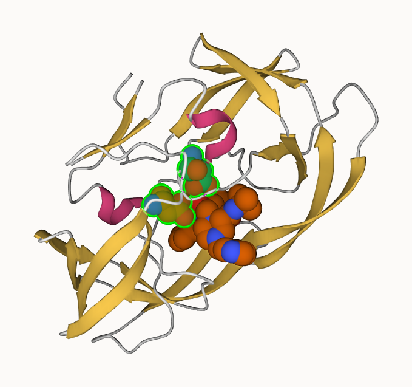
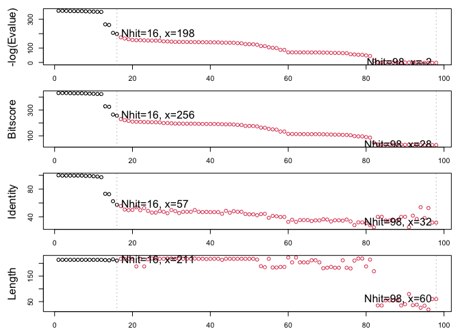
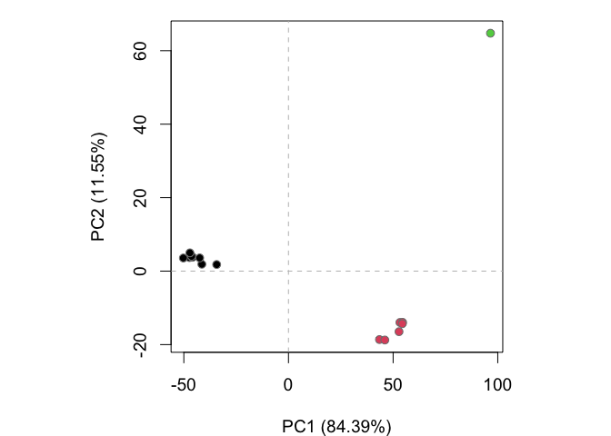
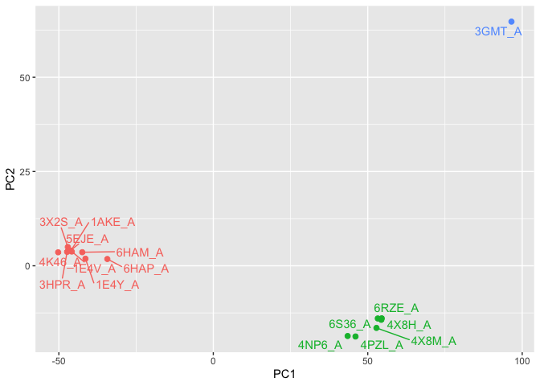
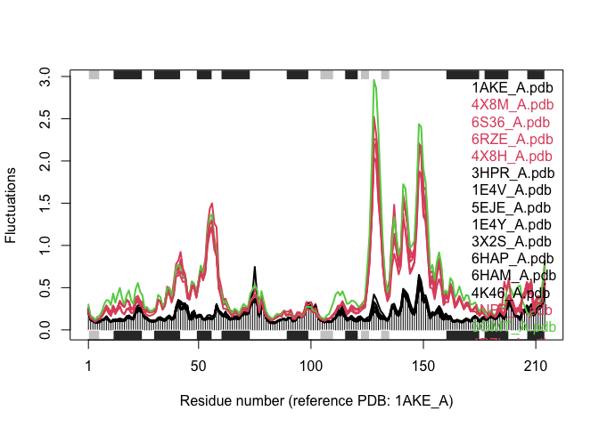

Class 9: Stuctural Bioinformatics 1
================
Tahmid Ahmed

## The RCSB Protein Data Bank (PDB)

Protein structures by X-ray crystalography dominate this database. We
are skipping Q1-3 because the site was too slow for us.

> Q4: Water molecules normally have 3 atoms. Why do we see just one atom
> per water molecule in this structure?

The hydrogen atoms are too small to image therefore for each water
molecule we are seeing the oxygen atom.

> Q5: There is a critical “conserved” water molecule in the binding
> site. Can you identify this water molecule? What residue number does
> this water molecule have

Water molecule 308.

> Q6 Generate and save a figure clearly showing the two distinct chains
> of HIV-protease along with the ligand. You might also consider showing
> the catalytic residues ASP 25 in each chain (we recommend “Ball &
> Stick” for these side-chains). Add this figure to your Quarto
> document.



> Q6.2 Discussion Topic: Can you think of a way in which indinavir, or
> even larger ligands and substrates, could enter the binding site?

The protein could undergo a conformational change in response to the
environment such as pH or specific ions, to allow larger substrates to
fit into the active site.

## 3. Introduction to Bio3D in R

Bio3D is an R package for structural bioinformatics. To use it we need
to callit up with the `library()` function (just like any package). We
also use `read.pdb()` to read a PDB file.

``` r
library(bio3d)
pdb <- read.pdb("1hsg")
```

      Note: Accessing on-line PDB file

``` r
pdb
```


     Call:  read.pdb(file = "1hsg")

       Total Models#: 1
         Total Atoms#: 1686,  XYZs#: 5058  Chains#: 2  (values: A B)

         Protein Atoms#: 1514  (residues/Calpha atoms#: 198)
         Nucleic acid Atoms#: 0  (residues/phosphate atoms#: 0)

         Non-protein/nucleic Atoms#: 172  (residues: 128)
         Non-protein/nucleic resid values: [ HOH (127), MK1 (1) ]

       Protein sequence:
          PQITLWQRPLVTIKIGGQLKEALLDTGADDTVLEEMSLPGRWKPKMIGGIGGFIKVRQYD
          QILIEICGHKAIGTVLVGPTPVNIIGRNLLTQIGCTLNFPQITLWQRPLVTIKIGGQLKE
          ALLDTGADDTVLEEMSLPGRWKPKMIGGIGGFIKVRQYDQILIEICGHKAIGTVLVGPTP
          VNIIGRNLLTQIGCTLNF

    + attr: atom, xyz, seqres, helix, sheet,
            calpha, remark, call

> Q7: How many amino acid residues are there in this pdb object?

198 residues.

> Q8: Name one of the two non-protein residues?

HOH

> Q9: How many protein chains are in this structure?

2 chains being A and B.

> Q10. Which of the packages above is found only on BioConductor and not
> CRAN?

msa

> Which of the above packages is not found on BioConductor or CRAN?

Grantlab/bio3d-view under bitbucket

> True or False? Functions from the devtools package can be used to
> install packages from GitHub and BitBucket?

True

# Comparative analysis of Adenylate kinase (ADK)

We will start our analysis with a single PDB id (code from the PDB
database): 1AKE

First we get it’s primary sequence:

``` r
library(bio3d)
aa <- get.seq("1ake_A")
```

    Warning in get.seq("1ake_A"): Removing existing file: seqs.fasta

    Fetching... Please wait. Done.

``` r
aa
```

                 1        .         .         .         .         .         60 
    pdb|1AKE|A   MRIILLGAPGAGKGTQAQFIMEKYGIPQISTGDMLRAAVKSGSELGKQAKDIMDAGKLVT
                 1        .         .         .         .         .         60 

                61        .         .         .         .         .         120 
    pdb|1AKE|A   DELVIALVKERIAQEDCRNGFLLDGFPRTIPQADAMKEAGINVDYVLEFDVPDELIVDRI
                61        .         .         .         .         .         120 

               121        .         .         .         .         .         180 
    pdb|1AKE|A   VGRRVHAPSGRVYHVKFNPPKVEGKDDVTGEELTTRKDDQEETVRKRLVEYHQMTAPLIG
               121        .         .         .         .         .         180 

               181        .         .         .   214 
    pdb|1AKE|A   YYSKEAEAGNTKYAKVDGTKPVAEVRADLEKILG
               181        .         .         .   214 

    Call:
      read.fasta(file = outfile)

    Class:
      fasta

    Alignment dimensions:
      1 sequence rows; 214 position columns (214 non-gap, 0 gap) 

    + attr: id, ali, call

> Q13. How many amino acids are in this sequence, i.e. how long is this
> sequence?

214 amino acids.

``` r
# Blast or hmmer search 
b <- blast.pdb(aa)
```

     Searching ... please wait (updates every 5 seconds) RID = SHZWFDCJ01N 
     ..
     Reporting 98 hits

``` r
# Plot a summary of search results
hits <- plot(b)
```

      * Possible cutoff values:    197 -3 
                Yielding Nhits:    16 98 

      * Chosen cutoff value of:    197 
                Yielding Nhits:    16 



``` r
# List out some 'top hits'
head(hits$pdb.id)
```

    [1] "1AKE_A" "4X8M_A" "6S36_A" "6RZE_A" "4X8H_A" "3HPR_A"

``` r
# Download releated PDB files
files <- get.pdb(hits$pdb.id, path="pdbs", split=TRUE, gzip=TRUE)
```

    Warning in get.pdb(hits$pdb.id, path = "pdbs", split = TRUE, gzip = TRUE): pdbs/
    1AKE.pdb.gz exists. Skipping download

    Warning in get.pdb(hits$pdb.id, path = "pdbs", split = TRUE, gzip = TRUE): pdbs/
    4X8M.pdb.gz exists. Skipping download

    Warning in get.pdb(hits$pdb.id, path = "pdbs", split = TRUE, gzip = TRUE): pdbs/
    6S36.pdb.gz exists. Skipping download

    Warning in get.pdb(hits$pdb.id, path = "pdbs", split = TRUE, gzip = TRUE): pdbs/
    6RZE.pdb.gz exists. Skipping download

    Warning in get.pdb(hits$pdb.id, path = "pdbs", split = TRUE, gzip = TRUE): pdbs/
    4X8H.pdb.gz exists. Skipping download

    Warning in get.pdb(hits$pdb.id, path = "pdbs", split = TRUE, gzip = TRUE): pdbs/
    3HPR.pdb.gz exists. Skipping download

    Warning in get.pdb(hits$pdb.id, path = "pdbs", split = TRUE, gzip = TRUE): pdbs/
    1E4V.pdb.gz exists. Skipping download

    Warning in get.pdb(hits$pdb.id, path = "pdbs", split = TRUE, gzip = TRUE): pdbs/
    5EJE.pdb.gz exists. Skipping download

    Warning in get.pdb(hits$pdb.id, path = "pdbs", split = TRUE, gzip = TRUE): pdbs/
    1E4Y.pdb.gz exists. Skipping download

    Warning in get.pdb(hits$pdb.id, path = "pdbs", split = TRUE, gzip = TRUE): pdbs/
    3X2S.pdb.gz exists. Skipping download

    Warning in get.pdb(hits$pdb.id, path = "pdbs", split = TRUE, gzip = TRUE): pdbs/
    6HAP.pdb.gz exists. Skipping download

    Warning in get.pdb(hits$pdb.id, path = "pdbs", split = TRUE, gzip = TRUE): pdbs/
    6HAM.pdb.gz exists. Skipping download

    Warning in get.pdb(hits$pdb.id, path = "pdbs", split = TRUE, gzip = TRUE): pdbs/
    4K46.pdb.gz exists. Skipping download

    Warning in get.pdb(hits$pdb.id, path = "pdbs", split = TRUE, gzip = TRUE): pdbs/
    4NP6.pdb.gz exists. Skipping download

    Warning in get.pdb(hits$pdb.id, path = "pdbs", split = TRUE, gzip = TRUE): pdbs/
    3GMT.pdb.gz exists. Skipping download

    Warning in get.pdb(hits$pdb.id, path = "pdbs", split = TRUE, gzip = TRUE): pdbs/
    4PZL.pdb.gz exists. Skipping download


      |                                                                            
      |                                                                      |   0%
      |                                                                            
      |====                                                                  |   6%
      |                                                                            
      |=========                                                             |  12%
      |                                                                            
      |=============                                                         |  19%
      |                                                                            
      |==================                                                    |  25%
      |                                                                            
      |======================                                                |  31%
      |                                                                            
      |==========================                                            |  38%
      |                                                                            
      |===============================                                       |  44%
      |                                                                            
      |===================================                                   |  50%
      |                                                                            
      |=======================================                               |  56%
      |                                                                            
      |============================================                          |  62%
      |                                                                            
      |================================================                      |  69%
      |                                                                            
      |====================================================                  |  75%
      |                                                                            
      |=========================================================             |  81%
      |                                                                            
      |=============================================================         |  88%
      |                                                                            
      |==================================================================    |  94%
      |                                                                            
      |======================================================================| 100%

``` r
# Align releated PDBs
pdbs <- pdbaln(files, fit = TRUE)#, exefile="msa")
```

    Reading PDB files:
    pdbs/split_chain/1AKE_A.pdb
    pdbs/split_chain/4X8M_A.pdb
    pdbs/split_chain/6S36_A.pdb
    pdbs/split_chain/6RZE_A.pdb
    pdbs/split_chain/4X8H_A.pdb
    pdbs/split_chain/3HPR_A.pdb
    pdbs/split_chain/1E4V_A.pdb
    pdbs/split_chain/5EJE_A.pdb
    pdbs/split_chain/1E4Y_A.pdb
    pdbs/split_chain/3X2S_A.pdb
    pdbs/split_chain/6HAP_A.pdb
    pdbs/split_chain/6HAM_A.pdb
    pdbs/split_chain/4K46_A.pdb
    pdbs/split_chain/4NP6_A.pdb
    pdbs/split_chain/3GMT_A.pdb
    pdbs/split_chain/4PZL_A.pdb
       PDB has ALT records, taking A only, rm.alt=TRUE
    ..   PDB has ALT records, taking A only, rm.alt=TRUE
    .   PDB has ALT records, taking A only, rm.alt=TRUE
    ..   PDB has ALT records, taking A only, rm.alt=TRUE
    ..   PDB has ALT records, taking A only, rm.alt=TRUE
    ....   PDB has ALT records, taking A only, rm.alt=TRUE
    .   PDB has ALT records, taking A only, rm.alt=TRUE
    ....

    Extracting sequences

    pdb/seq: 1   name: pdbs/split_chain/1AKE_A.pdb 
       PDB has ALT records, taking A only, rm.alt=TRUE
    pdb/seq: 2   name: pdbs/split_chain/4X8M_A.pdb 
    pdb/seq: 3   name: pdbs/split_chain/6S36_A.pdb 
       PDB has ALT records, taking A only, rm.alt=TRUE
    pdb/seq: 4   name: pdbs/split_chain/6RZE_A.pdb 
       PDB has ALT records, taking A only, rm.alt=TRUE
    pdb/seq: 5   name: pdbs/split_chain/4X8H_A.pdb 
    pdb/seq: 6   name: pdbs/split_chain/3HPR_A.pdb 
       PDB has ALT records, taking A only, rm.alt=TRUE
    pdb/seq: 7   name: pdbs/split_chain/1E4V_A.pdb 
    pdb/seq: 8   name: pdbs/split_chain/5EJE_A.pdb 
       PDB has ALT records, taking A only, rm.alt=TRUE
    pdb/seq: 9   name: pdbs/split_chain/1E4Y_A.pdb 
    pdb/seq: 10   name: pdbs/split_chain/3X2S_A.pdb 
    pdb/seq: 11   name: pdbs/split_chain/6HAP_A.pdb 
    pdb/seq: 12   name: pdbs/split_chain/6HAM_A.pdb 
       PDB has ALT records, taking A only, rm.alt=TRUE
    pdb/seq: 13   name: pdbs/split_chain/4K46_A.pdb 
       PDB has ALT records, taking A only, rm.alt=TRUE
    pdb/seq: 14   name: pdbs/split_chain/4NP6_A.pdb 
    pdb/seq: 15   name: pdbs/split_chain/3GMT_A.pdb 
    pdb/seq: 16   name: pdbs/split_chain/4PZL_A.pdb 

``` r
pdbs <- pdbaln(files, fit = TRUE)#, exefile="msa")
```

    Reading PDB files:
    pdbs/split_chain/1AKE_A.pdb
    pdbs/split_chain/4X8M_A.pdb
    pdbs/split_chain/6S36_A.pdb
    pdbs/split_chain/6RZE_A.pdb
    pdbs/split_chain/4X8H_A.pdb
    pdbs/split_chain/3HPR_A.pdb
    pdbs/split_chain/1E4V_A.pdb
    pdbs/split_chain/5EJE_A.pdb
    pdbs/split_chain/1E4Y_A.pdb
    pdbs/split_chain/3X2S_A.pdb
    pdbs/split_chain/6HAP_A.pdb
    pdbs/split_chain/6HAM_A.pdb
    pdbs/split_chain/4K46_A.pdb
    pdbs/split_chain/4NP6_A.pdb
    pdbs/split_chain/3GMT_A.pdb
    pdbs/split_chain/4PZL_A.pdb
       PDB has ALT records, taking A only, rm.alt=TRUE
    ..   PDB has ALT records, taking A only, rm.alt=TRUE
    .   PDB has ALT records, taking A only, rm.alt=TRUE
    ..   PDB has ALT records, taking A only, rm.alt=TRUE
    ..   PDB has ALT records, taking A only, rm.alt=TRUE
    ....   PDB has ALT records, taking A only, rm.alt=TRUE
    .   PDB has ALT records, taking A only, rm.alt=TRUE
    ....

    Extracting sequences

    pdb/seq: 1   name: pdbs/split_chain/1AKE_A.pdb 
       PDB has ALT records, taking A only, rm.alt=TRUE
    pdb/seq: 2   name: pdbs/split_chain/4X8M_A.pdb 
    pdb/seq: 3   name: pdbs/split_chain/6S36_A.pdb 
       PDB has ALT records, taking A only, rm.alt=TRUE
    pdb/seq: 4   name: pdbs/split_chain/6RZE_A.pdb 
       PDB has ALT records, taking A only, rm.alt=TRUE
    pdb/seq: 5   name: pdbs/split_chain/4X8H_A.pdb 
    pdb/seq: 6   name: pdbs/split_chain/3HPR_A.pdb 
       PDB has ALT records, taking A only, rm.alt=TRUE
    pdb/seq: 7   name: pdbs/split_chain/1E4V_A.pdb 
    pdb/seq: 8   name: pdbs/split_chain/5EJE_A.pdb 
       PDB has ALT records, taking A only, rm.alt=TRUE
    pdb/seq: 9   name: pdbs/split_chain/1E4Y_A.pdb 
    pdb/seq: 10   name: pdbs/split_chain/3X2S_A.pdb 
    pdb/seq: 11   name: pdbs/split_chain/6HAP_A.pdb 
    pdb/seq: 12   name: pdbs/split_chain/6HAM_A.pdb 
       PDB has ALT records, taking A only, rm.alt=TRUE
    pdb/seq: 13   name: pdbs/split_chain/4K46_A.pdb 
       PDB has ALT records, taking A only, rm.alt=TRUE
    pdb/seq: 14   name: pdbs/split_chain/4NP6_A.pdb 
    pdb/seq: 15   name: pdbs/split_chain/3GMT_A.pdb 
    pdb/seq: 16   name: pdbs/split_chain/4PZL_A.pdb 

``` r
# Vector containing PDB codes for figure axis
ids <- basename.pdb(pdbs$id)

# Draw schematic alignment
#plot too large to input
#plot(pdbs, labels=ids)
```

``` r
anno <- pdb.annotate(ids)
unique(anno$source)
```

    [1] "Escherichia coli"                                
    [2] "Escherichia coli K-12"                           
    [3] "Escherichia coli O139:H28 str. E24377A"          
    [4] "Escherichia coli str. K-12 substr. MDS42"        
    [5] "Photobacterium profundum"                        
    [6] "Vibrio cholerae O1 biovar El Tor str. N16961"    
    [7] "Burkholderia pseudomallei 1710b"                 
    [8] "Francisella tularensis subsp. tularensis SCHU S4"

``` r
# Perform PCA
pc.xray <- pca(pdbs)
plot(pc.xray)
```


``` r
# Calculate RMSD
rd <- rmsd(pdbs)
```

    Warning in rmsd(pdbs): No indices provided, using the 204 non NA positions

``` r
# Structure-based clustering
hc.rd <- hclust(dist(rd))
grps.rd <- cutree(hc.rd, k=3)

plot(pc.xray, 1:2, col="grey50", bg=grps.rd, pch=21, cex=1)
```



``` r
# Visualize first principal component
pc1 <- mktrj(pc.xray, pc=1, file="pc_1.pdb")
```

``` r
#Plotting results with ggplot2
library(ggplot2)
library(ggrepel)

df <- data.frame(PC1=pc.xray$z[,1], 
                 PC2=pc.xray$z[,2], 
                 col=as.factor(grps.rd),
                 ids=ids)

p <- ggplot(df) + 
  aes(PC1, PC2, col=col, label=ids) +
  geom_point(size=2) +
  geom_text_repel(max.overlaps = 20) +
  theme(legend.position = "none")
p
```



``` r
# NMA of all structures
modes <- nma(pdbs)
```


    Details of Scheduled Calculation:
      ... 16 input structures 
      ... storing 606 eigenvectors for each structure 
      ... dimension of x$U.subspace: ( 612x606x16 )
      ... coordinate superposition prior to NM calculation 
      ... aligned eigenvectors (gap containing positions removed)  
      ... estimated memory usage of final 'eNMA' object: 45.4 Mb 


      |                                                                            
      |                                                                      |   0%
      |                                                                            
      |====                                                                  |   6%
      |                                                                            
      |=========                                                             |  12%
      |                                                                            
      |=============                                                         |  19%
      |                                                                            
      |==================                                                    |  25%
      |                                                                            
      |======================                                                |  31%
      |                                                                            
      |==========================                                            |  38%
      |                                                                            
      |===============================                                       |  44%
      |                                                                            
      |===================================                                   |  50%
      |                                                                            
      |=======================================                               |  56%
      |                                                                            
      |============================================                          |  62%
      |                                                                            
      |================================================                      |  69%
      |                                                                            
      |====================================================                  |  75%
      |                                                                            
      |=========================================================             |  81%
      |                                                                            
      |=============================================================         |  88%
      |                                                                            
      |==================================================================    |  94%
      |                                                                            
      |======================================================================| 100%

``` r
plot(modes, pdbs, col=grps.rd)
```

    Extracting SSE from pdbs$sse attribute



> Q14. What do you note about this plot? Are the black and colored lines
> similar or different? Where do you think they differ most and why?

I notice that the green line has the highest peaks. The colored lines
have substantially higher peaks than the black lines. This indicates
that adk has two conformations, one being the colored lines and the
other being the black line. I believe they differ most around the 150
residue region.

``` r
# Visualize first principal component
pc1 <- mktrj(pc.xray, pc=1, file="pc_1.pdb")
```


